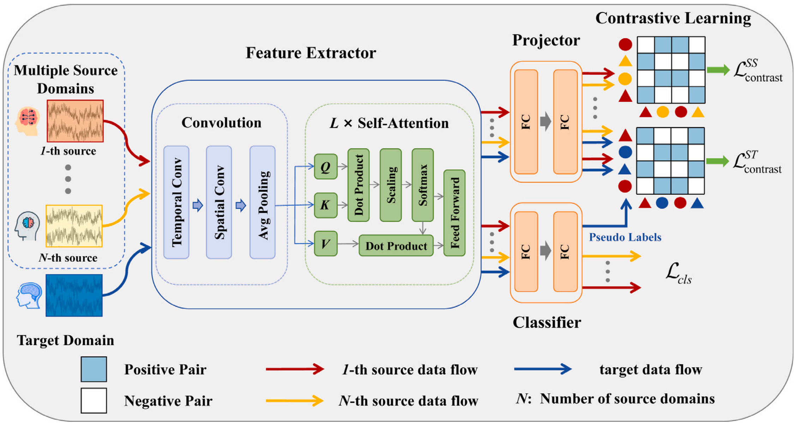

# CLUDA

This repository contains the implementation of **Contrastive Learning-based Unsupervised multi-source Domain Adaptation (CLUDA)**, published in *Expert Systems With Applications 2025*:

> Chengjian Xu, Yonghao Song, Qingqing Zheng, Qiong Wang, and Pheng-Ann Heng.  
> "Unsupervised multi-source domain adaptation via contrastive learning for EEG classification."  
> *Expert Systems With Applications*, 261:125452, 2025.

## Overview

CLUDA is designed for subject-independent EEG motor imagery classification. Instead of merging all labeled source subjects into a single source domain, CLUDA treats each subject as an individual source domain and performs unsupervised multi-source domain adaptation with unlabeled target-subject data.

The main idea is to learn domain-invariant and class-discriminative EEG representations with contrastive learning:

- **Source-target contrastive learning** aligns each source domain with the unlabeled target domain using pseudo labels from the classifier.
- **Inter-source contrastive learning** reduces discrepancies among different source domains.
- **Convolutional Transformer feature extraction** captures both local spatial-temporal EEG patterns and long-range temporal dependencies.
- During testing, only the feature extractor and classifier are used for EEG classification.

## Framework



## Code

The repository provides a compact PyTorch implementation of CLUDA:

- `main.py`: training and evaluation entry point for leave-one-subject-out cross-subject experiments.
- `models.py`: CLUDA model definition, including the Conformer-style encoder, classifier, projector, and contrastive losses.
- `utils.py`: dataset loading, preprocessing, normalization, and data utility functions.

## Acknowledgement

This CLUDA implementation refers to the code structure and training workflow of [VoiceBeer/MS-MDA](https://github.com/VoiceBeer/MS-MDA). We thank the authors of MS-MDA for releasing their implementation.

## Citation

If you find this repository useful, please cite our paper:

```bibtex
@article{xu2025unsupervised,
  title = {Unsupervised multi-source domain adaptation via contrastive learning for EEG classification},
  author = {Xu, Chengjian and Song, Yonghao and Zheng, Qingqing and Wang, Qiong and Heng, Pheng-Ann},
  journal = {Expert Systems with Applications},
  volume = {261},
  pages = {125452},
  year = {2025},
  doi = {10.1016/j.eswa.2024.125452}
}
```
